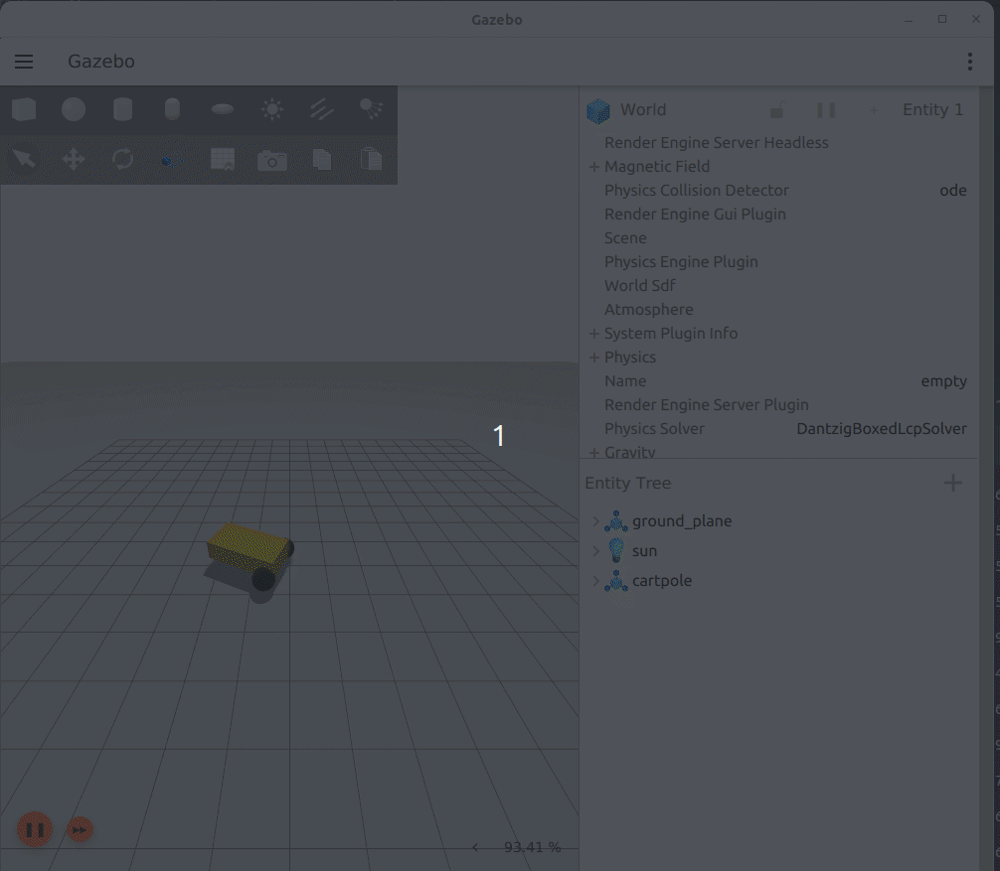
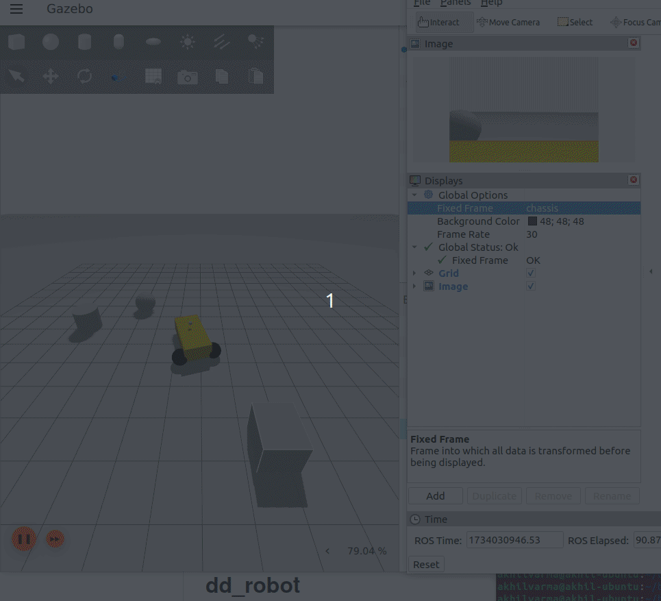

# dd_robot


## Camera Branch 
`dd_robot` is a differential drive robot simulation for ROS2. This package provides tools to simulate, control, and visualize a differential drive robot in a Gazebo environment.


**A simple differential drive Robot with a simple monocular camera**




## Table of Contents

- [Features](#features)
- [Prerequisites](#prerequisites)
- [Installation](#installation)
- [Usage](#usage)
- [Note](#note)
- [Credits](#credits)
  
## Features

- Differential drive robot simulation in Gazebo.
- Customizable via ROS2 parameters.
- Integrated command publisher for movement control using YAML file.
- Branch specific feature : Monocular Camera !!!

## Prerequisites

Before you begin, ensure you have met the following requirements:

- [ROS2](https://docs.ros.org/en/humble/Installation/Ubuntu-Install-Debians.html) (version `HUMBLE`).
- [Gazebo](https://gazebosim.org/docs/garden/ros_installation#installing-the-default-gazebo-version-for-a-ros-distribution-using-binary-installations) (version `FORTRESS`). Download 
- ROS2 Control and ROS2 Controller:
    ```bash 
    sudo apt-get install ros-humble-ros2-control
    sudo apt-get install ros-humble-ros2-controller
- gz_ros2_control -- [Compile from Source](https://github.com/ros-controls/gz_ros2_control/tree/humble?tab=readme-ov-file#compile-from-source). [SEE NOTES](#note)


## Installation

1. **Navigate to your ROS2 workspace**

    ```bash
    cd ~/ros2_ws/src/
    ```

2. **Clone the Repo inside the src file**

    ```bash
    git clone https://github.com/Spartan-Velanjeri/dd_robot.git
    cd dd_robot
    git checkout camera
    ```

3. **Build the package**

    ```bash
    cd ~/ros2_ws
    colcon build
    ```

4. **Source your ROS2 workspace**

    ```bash
    source install/setup.bash
    ```

## Usage

1. **Launch the Gazebo environment with the robot**

    ```bash
    ros2 launch dd_robot gazebo_robot.launch.py
    ```

You can see that the Differential Drive Robot starts moving based on a cyclic command present inside ```config/commands.yaml``` and is read from the ```scripts/cmd_vel_publisher.py```

Also you can use Rviz to visualise the camera under the topic 'camera'. You might have to add the objects manually for now :)

. 


## Note

 1. I've compiled gz-ros2-control from source, since I had trouble with the binary installation had failed for Humble. Make sure to clone gz_ros2_control inside your colcon workspace while doing the source compilation. Similarly, if you have any issue with ROS2 Control and ROS2 Controller, similarly build from [source](https://control.ros.org/humble/doc/getting_started/getting_started.html)

 2. Also if you get an error with running the cmd_vel_publisher, it could be due to your python version. Make sure to NOT run with any virtualenv or conda.

## Credits

Edited the [differential drive robot](https://github.com/ros-controls/gz_ros2_control/blob/master/gz_ros2_control_demos/urdf/test_diff_drive.xacro.urdf) from the [gz_ros2_control](https://github.com/ros-controls/gz_ros2_control/tree/master) package for this application.

Thank you !

`dd_robot` was developed by `Parthan Manisekaran`. For any questions or feedback, please reach out to `Parthanvelanjeri@Hotmail.com`.